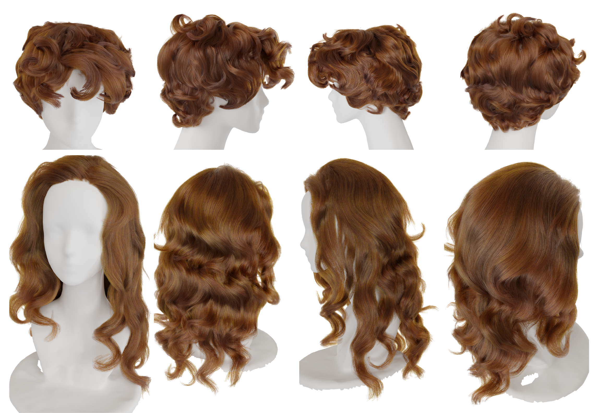

# MonoHair:High-Fidelity Hair Modeling from a Monocular Video ( CVPR2024 Oral ) [[Projectpage](https://keyuwu-cs.github.io/MonoHair/ "Projectpage")] #
This repository is the official code for MonoHair. Give a monocular video, MonoHair reconstruct a high-fidelity 3D strand model. 

In this repository we also give some examples for reconstructing 3D hair from a monocular video or multi-view images.

- We generate 3D avatar using flame template and fit the flame coarse geometry using multiview images (only for real human capture), more details please check [DELTA](https://github.com/yfeng95/DELTA "Delta") 
- For coarse goemtry initialization, please check [Instant-NGP](https://github.com/NVlabs/instant-ngp "Instant-NGP").
- For hair exterior geometry synthesis, we propose patch-based multi-view optimization (PMVO) method, please check our [Paper](https://arxiv.org/abs/2403.18356 "MonoHair").
- For hair interior inference, please check [DeepMVSHair](https://dl.acm.org/doi/abs/10.1145/3550469.3555385 "DeepMVSHair").
- For strands generate, please also check our paper.

## Getting Started ##
Clone the repository and install requirements:

    git clone https://github.com/KeyuWu-CS/MonoHair.git --recursive
	cd MonoHair
	conda create -n MonoHair python==3.10.12
	conda activate MonoHair
	pip install -r requirements.txt

## Dependencies and submodules ##

Install [Pytorch](https://pytorch.org/ "torch"), [Pytorch3d](https://github.com/facebookresearch/pytorch3d) and [tiny-cuda-nn](https://github.com/NVlabs/tiny-cuda-nn). We have tested on Ubuntu 22.04.4, python==3.10.12 pytorch==1.13.0, pytorch3d==0.7.6 with CUDA 11.6 on RTX 3090Ti. You can install any version that is compatible with these dependencies.

Initialize submodules of [Instant-NGP](https://github.com/NVlabs/instant-ngp "Instant-NGP"), [MODNet](https://github.com/ZHKKKe/MODNet "MODNet"), [CDGNet](https://github.com/tjpulkl/CDGNet "CDGNet"), [DELTA](https://github.com/yfeng95/DELTA "DELTA") and [face-parsing](https://github.com/zllrunning/face-parsing.PyTorch "face-parsing"). Download pretrained model for [MODNet](https://github.com/ZHKKKe/MODNet "MODNet"), [CDGNet](https://github.com/tjpulkl/CDGNet "CDGNet") and [face-parsing](https://github.com/zllrunning/face-parsing.PyTorch "face-parsing").

    git submodule update --init --recursive

Compile Instant-NGP and move our modified run.py to instant-ngp/scripts.

	cp run.py submodules/instant-ngp/scripts/
	cd submodules/instant-ngp
	cmake . -B build -DCMAKE_BUILD_TYPE=RelWithDebInfo
	cmake --build build --config RelWithDebInfo -j
	cd ../..

	

if you have problem with Instant-NGP compile. Please refer their [instruction](https://github.com/NVlabs/instant-ngp)

## Download assets ##
	### Download some pretrained model and data for avatar optimization.  
    bash fetch_data.sh

## Download examples ##
Download our example datas [One Driven](https://1drv.ms/f/s!AhfQmEHzY54Ya2gGaslXnM2IPCk?e=phk5me "One Driven"). For obtaining a certain results, we have run colmap and save the pretrained instant-ngp weight. Then you need to run the follow four steps to get the results. We also provide full results (include intermediate results) in full folder. You can use it to check the results of each step.  
**Tips:** Since the wig use the same unreal human head, we don't use flame (smplx) model as template and don't run multi-view bust fitting. 

## 3D Hair Reconstruction##

	# Prepare data: instant-ngp intialization, segmentation, gabor filter etc. You skip this step if use our provided data.
    python prepare_data.py --yaml=configs/reconstruct/big_wavy1 

	# Hair exterior optimization
	python PMVO.py --yaml=configs/reconstruct/big_wavy1

	# Hair interior inference
	python infer_inner.py --yaml=configs/reconstruct/big_wavy1
	
	# Strands generation
	python HairGrow.py --yaml=configs/reconstruct/big_wavy1

## Test your own data ##

## Citation ##

    @inproceedings{wu2024monohair,
	  title={MonoHair: High-Fidelity Hair Modeling from a Monocular Video},
	  author={Wu, Keyu and Yang, Lingchen and Kuang, Zhiyi and Feng, Yao and Han, Xutao and Shen, Yuefan and Fu, Hongbo and Zhou, Kun and Zheng, Youyi},
	  booktitle={Proceedings of the IEEE/CVF Conference on Computer Vision and Pattern Recognition},
	  pages={24164--24173},
	  year={2024}
	}

## Acknowledgments ##
Here are some great resources we benefit from:

- [MODNet](https://github.com/ZHKKKe/MODNet "MODNet") and [CDGNet](https://github.com/tjpulkl/CDGNet "CDGNet") to segment hair.
- [Instant-NGP](https://github.com/NVlabs/instant-ngp "Instant-NGP") for coarse initizalization.
- [DELTA](https://github.com/yfeng95/DELTA "DELTA") for bust fitting.
  

